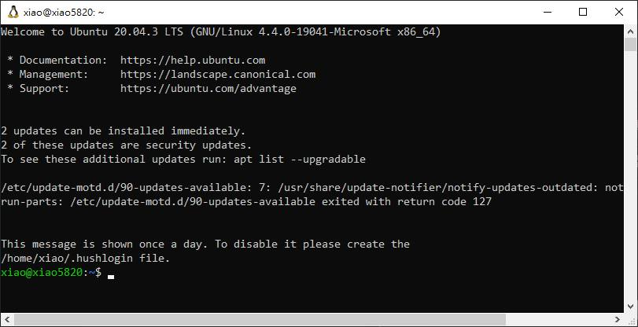

# Win10_install_Ubuntu
Win10, how to install Ubuntu support natively

### Windows Subsystem for Linux Installation Guide for Windows 10
#### it is not enabled by default, see how to by M$   
https://docs.microsoft.com/en-us/windows/wsl/install-win10  

###  or use GUI to do the job as following,

Enable this feature support first,  
1. Win10, [本機], input [控制台\程式集\程式和功能\, then hits [ENTER]     
  
  
2. open the setup, this window should pops up, clicks [開啟或關閉WINDOWS功能]      
  

3. select this feature to proceed with, [windows 子系統 LINUX 版], then press [確定]   
  

just be patient and waiting.... upon finish, Win10 will be asked to reboot.    
  
  
### Win10 support Linux is enabled, now to install Ubuntu 20.04.1 LTS  
now PC has been rebooted, open Microsoft Store, the app store by Microsoft. just like play store of Google or App store of Apple.  
find Ubuntu and install, maybe hour is required,  
  

### Ubuntu 20.04.1 LTS in installed, the first time invoke  
the system will asks you to select user name and password at the first time,  
for example,  
```
user name : xiao  
password : 0000  
```
easy for development platform and internally used;  


### Ubuntu 20.04.1 LTS, login & update the system  
```  
sudo apt-get update    
```  
do not forget to hits [Enter]  
  
required hour depends on speed of your network  


### Ubuntu 20.04.1 LTS, ready for the job  
#### caution, do not edit any of those files with Win10 tools or folder manipulation!!  
where to see those files of linux working environment, usually,  
```   
%userprofile%\AppData\Local\Packages\CanonicalGroupLimited.Ubuntu20.04onWindows_79rhkp1fndgsc
```   
and roots
```  
%userprofile%\AppData\Local\Packages\CanonicalGroupLimited.Ubuntu20.04onWindows_79rhkp1fndgsc\LocalState\rootfs
```  
and home folder
```  
%userprofile%\AppData\Local\Packages\CanonicalGroupLimited.Ubuntu20.04onWindows_79rhkp1fndgsc\LocalState\rootfs\home
```  


job done, something like this,  
  

### test, to build a simple program - hello world

copy the following, invoke Ubuntun, right click the mouse button, those commands will be done
```
  
clear  
  
mkdir hello  
cd hello  
  
## build hello.c  
cat <<EOT >> hello.c  
/*C program to get current system date and time in Linux.*/  
   
#include <stdio.h>  
#include <time.h>  
   
int main()  
{  
    time_t T= time(NULL);  
    struct  tm tm = *localtime(&T);  
       
    printf("System Date is: %02d/%02d/%04d\n",tm.tm_mday, tm.tm_mon+1, tm.tm_year+1900);  
    printf("System Time is: %02d:%02d:%02d\n",tm.tm_hour, tm.tm_min, tm.tm_sec);  
   
    return 0;  
}  
EOT
  
## show content hello.c  
#cat hello.c  
  
## compile hello.c  
gcc -o hello hello.c  
  
## run program  
./hello  
ls  
  
  
  
```  

if you see something like this, the program build is successful,   

  


### 2023-FEB-10
run this ubutnu, it prompts need to update wsl2, update done and the icon has been changed  
open cmd,  
```
wsl -- list --online
wsl --update

```

ubutnu 的小 icon 被換成了小企鵝.  
  
這只企鵝很古怪, 說甚麼的呢, 不支援主控台設定 ??  
先解決小問題,  不然打開閃屏就關不能用,  
難道是這樣幹掉它?!  
原來就是它搞怪  解決方法 [2023-02-10_wsl_update](2023-02-10_wsl_update)  
企鵝終於跑起來了  

  
